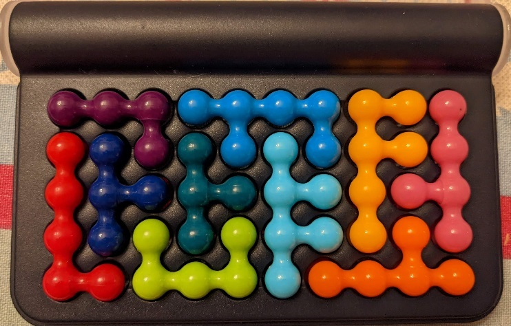
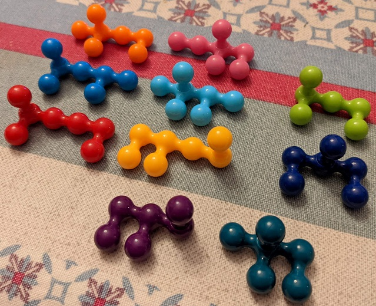
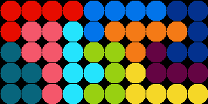
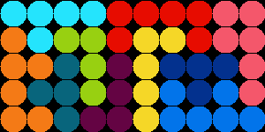
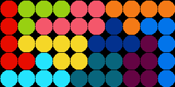
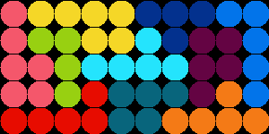
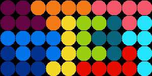

# Puzzle solver

This is a solver for a little puzzle using 10 pieces on a 5x10 grid.

A solved grid looks like this:



But pieces are actually 3D and actually have 2 "sides":



## Main approach

### Pruning invalid piece sides combinations

The search space is actually quite big despite the small grid size:
each piece has 2 sides, and each side can be placed in 4 orientations.
We then have to choose one of those 8 possibilities for each piece and layout the pieces in the grid.

There are 2^10 = 1024 combinations of piece sides that we can choose from.

Not all combinations of piece sides are worth investigating, though.
For each piece, one side covers one less slot than the other, so there is a "small" and a "big" side.
If we take the small side of all pieces, we can't cover the whole grid.
Similarly, if we take the big side of all pieces, the pieces will never fit.

We can therefore start by computing which combinations actually cover 50 slots (in the 5x10 grid),
using a very simple recursive backtracking algorithm. Recursion is OK because we only go 10 levels deep.

This brings down the number of valid combinations of sides from 1024 to 210.

### Placing pieces

Given a combination of piece sides, we can then try to place the pieces in the grid by also using a recursive
backtracking algorithm.

For each of the 10 "sided" pieces in the combination, we can try all possible placements in all 4 orientations.
We check if the piece can be placed in a given orientation and at a given position, 
and if yes we do it and recurse for the next piece.

### Performance

One interesting thing to note is that the grid has only 50 slots, which is smaller than 64.
This means we can represent a boolean state of all grid slots in a single 64-bit `Long`.

This can be used to represent a grid state with taken or empty slots, but also a placed piece as a bit mask.
Checking if a piece fits or adding a piece to the grid can therefore be made very fast using simple bitwise operators.

### Outputting solutions

There are a total of **301350 unique solutions** to this puzzle.
We can consider only half of those if we don't want to count the solutions that are identical when rotating the whole
grid by 180 degrees.

The raw output of bit mask numbers is barely useful to use it in the puzzle.

A more "visual" output would be for instance a text file with 5 lines, each of 10 characters, representing the slots of the grid.
Since there are 10 pieces, each piece can be given a digit, and that digit would be used for each slot covered by the piece:

```
0000333388
0510739388
5517729998
6511722448
6666724444
```

Even better, we can actually write images to visualize more easily the pieces and reproduce this on the physical object.
Here are some sample solutions:









